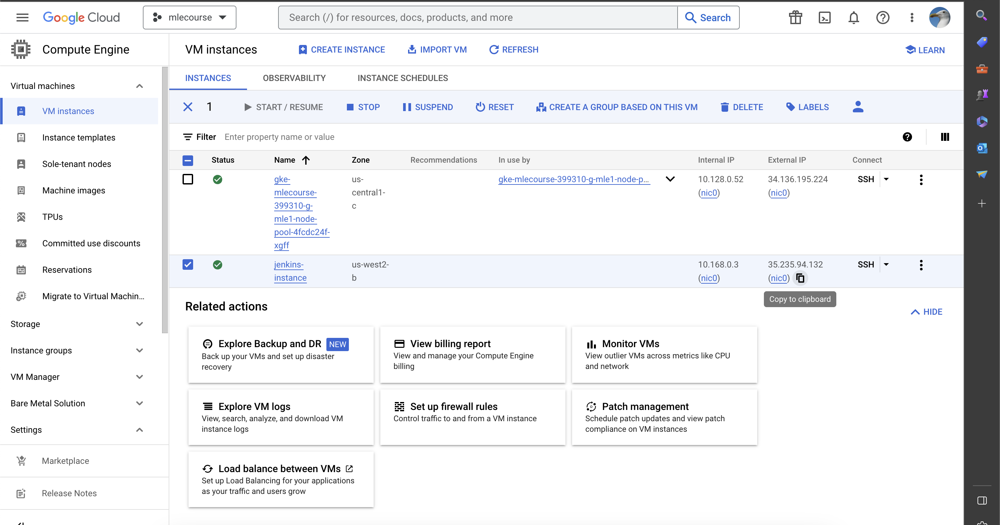

# MLE practice - Diabetes Prediction model

<!-- @import "[TOC]" {cmd="toc" depthFrom=1 depthTo=6 orderedList=false} -->
<!-- code_chunk_output -->

* Contents:
    * [Introduction](#introduction)
	* [Requirements](#requirements)
    * [System architecture](#systemarchitecture)
	* [Usage](#usage)
	* [Additional Usage](#additioanlusage)
	* [TODOs](#todos)
<!-- /code_chunk_output -->

## Introduction:
This is the last module project when I first learned about MLE. I will build and serving diabetes-prediciton model as in a production environment. I also used tool & technologies to quickly deploy the ML system into production and automate processes during the development and deployment of the ML system.
## System architecture:


* Source control: Git/Github
* CI/CD: Jenkins
* Experiment tracking & Model registry: MLflow
* Build API: FastAPI
* Containerize application: Docker
* Container orchestration system: Kubernetes/K8S

### Kubernetes architecture:


## Installation:
### Install the gcloud CLI:
You can easily connect to GKE using the Gcloud CLI. Reading this guide to install gcloud CLI [gcloud CLI](https://cloud.google.com/sdk/docs/install#deb).

After that, initialize the gcloud CLI by typing `gcloud init`, then type "Y"
```bash
gcloud init
```
**Note**:
* A pop-up to select your Google account will appear, select the one you used to register GCP, and click the button Allow
* Now, go back to your terminal, in which you typed `gcloud init`, choose your project, and Enter.
*  Then type Y, and select the area that is ideal for you., then Enter.
### Install dev environment:
#### Requirements:

* joblib=1.3.2
* numpy=1.25.2
* xgboost=1.7.6
* scikit-learn=1.3.0
* fastapi=0.103.1
* uvicorn[standard]=0.23.2
* pydantic=2.3.0
* pytest=7.1.2
* ansible=8.3.0
* requests=2.31.0
* google-auth=2.23.0
* google-auth-httplib2=0.1.1
* google-auth-oauthlib=1.1.0
* google-cloud=0.34.0
* pre-commit=3.4.0

```bash
pip install -r requirements_dev.txt
```

**Note**: Simply said, this is the setting when you code locally. The `requirements.txt` file specifies the application environment in detail.

### Additional Installation (Skip if you have already installed):
* [Docker](https://docs.docker.com/desktop/install/ubuntu/)
* [Kubectl](https://kubernetes.io/docs/tasks/tools/install-kubectl-linux/)
* [kubectx + kubens](https://github.com/ahmetb/kubectx#manual-installation-macos-and-linux) (Optional)
* [Terraform](https://developer.hashicorp.com/terraform/tutorials/aws-get-started/install-cli#install-terraform)
## Usage:

### Create Jenkins on google cloud VM:

Let's create your Jenkins VM instance using `ansible`.

Before creating google cloud VM by ansbile, you must first prepare a few things to access the GCP like `service account`. You can refer to this link [Create service account](https://cloud.google.com/iam/docs/service-accounts-create)

**Note**: When creating a service account, grant it `Compute admin` permission. And then:

* Find the three dots icon in the service account's Actions column, then select Manage keys.
* Click ADD KEY, then Create new key
* Download a JSON file by selecting CREATE. Keep this file SAFE at all times.
* Put your credentials under the folder `/local/ansible/secrets`

Create Jenkins VM instance on GCP.
```bash
cd /local/ansible/deploy_jenkins
ansible-playbook create_compute_instance.yaml
```

**Note**:Please check the file `create_compute_instance.yaml`. The `project id` and `service account` should be changed to match yours (e.g., line 11 & line 14, line 43 & line 45).

After creating your Jenkins VM instance on GCP, navigate to [VM instance UI](https://console.cloud.google.com/compute/instances) and COPY `external IP` corresponding with yours. I COPY `external IP` "jenkins-instance" for example:



Modify the IP of the newly created instance to the `inventory` file, then run the following commands:
```bash
ansible-playbook -i ../inventory deploy_jenkins.yml
```

<!-- Integrate your github source to the Jenkins VM once it has been created. You can follow this link: [Integrate Jenkins with GitHub ](https://www.whizlabs.com/blog/integrate-jenkins-with-github/) -->
#### Add SSH key:
First, check if we can connect to the External IP via port 22 by using telnet on your local terminal:
```bash
telnel <jenkins_external_IP> 22
```

You will see a notification that you have successfully connected if you did it correctly

Generate your SSH key first. Open your local terminal, type `ssh-keygen` and type Enter to die until Overwrite:
```bash
ssh-keygen
```

Navigate to [METADATA](https://console.cloud.google.com/compute/metadata) and Select the tab SSH KEYS and click the button + ADD ITEM (or ADD SSH KEY if you don’t see the + ADD ITEM button):

Copy the content of your file `~/.ssh/id_rsa.pub` to GCP and press the blue button SAVE at the bottom of the page:


**Note**: To see the content of the file `~/.ssh/id_rsa.pub`, use the cat command
```bash
cat ~/.ssh/id_rsa.pub
```

### Create GKE cluster:

Change directory to `/terraform` folder and initializes a working directory containing Terraform configuration files.
```bash
cd /terraform
terraform init
```
Then you can creates an execution plan, which lets you preview the changes that Terraform plans to make to your infrastructure.

```bash
terraform plan
```

Note: Before creates an execution plan, you should authenticate with GCP first using the following command:

```bash
gcloud auth application-default login
```

Carries out the planned changes to each resource using the relevant infrastructure provider's API.

**Note**: It will ask you for confirmation before making any changes. Type `yes` if you have checked the execution plan carefully.

```bash
terraform apply
```

### Connect to the GKE cluster:

After `terraform apply` successfully, you have now initialized the gke cluster. Let's install [Helm](https://helm.sh/docs/intro/install/) to deploy application on the k8s cluster easily.

Then navigate to [GKE UI](https://console.cloud.google.com/kubernetes):


Click on the cluster "mlecourse-399310-gke" for example and select "CONNECT"


Copy the line "gcloud container ..." into your local terminal as follows:
```bash
gcloud container clusters get-credentials <your_gke_name> --zone us-central1-c --project <your_project_id>
```
We can see the line "kubeconfig entry generated for mlecourse-399310-gke".

Then, switch to your gke cluster using kubectx:
```bash
kubectx <YOUR_GKE_CLUSTER>
```

I'll install the `nginx controller` on this new cluster right away because I'm not working with GCP's default ingress controller.

```bash
helm upgrade --install ingress-nginx ingress-nginx --repo https://kubernetes.github.io/ingress-nginx --namespace ingress-nginx --create-namespace
```

### CI/CD with Jenkins:

First, ssh to your new jenkins VM again:
```bash
ssh -i ~/.ssh/id_rsa username@jenkins_externalIP
```

Check if `jenkins` container is running:
```bash
sudo docker ps
```


Ok! jenkins is running successfully. Let get the jenkins password now:
```bash
sudo docker exec -ti jenkins cat /var/jenkins_home/secrets/initialAdminPassword
```

Open web browser jenkins UI through http://yourExternalIP:8081/ and paste jenkins password:


After entering the password, install the "set sugested plugin". And information for the user can be next/skiped and so on ...


Now, you are in Jenkin UI:


Then navigate to Dashboard > Manage Jenkins > Plugins > Available plugin. And SELECT Docker, Docker pipeline, gcloud SDK, kubernetes. Then SELECT "Install without restart" or "Download now and install after restart"


## Additional Usage:
In case you want EDA and training model from my notebooks. You need deploy MLflow up by following command:
```bash
pip install mlflow==2.6.0
docker compose -f ./ops_platform/mlflow/mlflow-docker-compose.yml up -d
```
Then you can open MLflow's web browser through: http://localhost:5000/


Now, you can do Experiment tracking & Model registry more easier with MLflow.

## TODOs
 + Building observability system on kubernetes (Prometheus and grafana)
