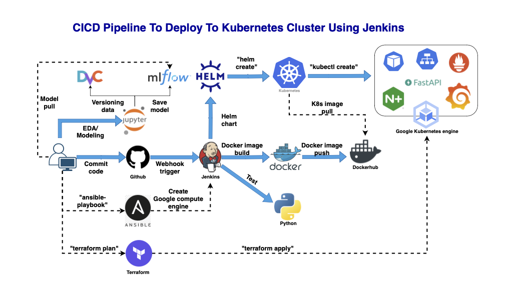
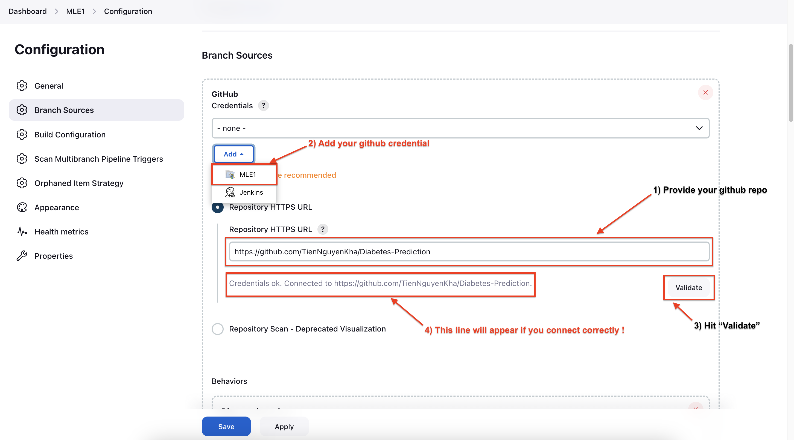

# Diabetes prediction model deployment - CI/CD Pipeline To Deploy To Kubernetes Cluster Using Jenkins

<!-- @import "[TOC]" {cmd="toc" depthFrom=1 depthTo=6 orderedList=false} -->
<!-- code_chunk_output -->

* Contents:
	* [Repository structure](#repository-structure)
    * [Introduction](#introduction)
    <!-- * [System architecture](#system-architecture) -->
	* [Prerequisites installation](#prerequisites-installation)
	* [Component Preparation](#component-preparation)
	* [Usage](#usage)
	* [Additional Usage](#additional-usage)
	* [TODOs](#todos)
<!-- /code_chunk_output -->
## Repository structure:

```txt
Diabetes-Prediction
 └──|
	├── app
	│    ├── utils                                       /* Includes supplementary codes, e.g, logger object */
	│    └── main.py                                     /* Main executable file */
	├── app_chart                                        /* Helm chart to deploy application */
	├── assets 											 /* Images and gifs */
	├── data 											 /* Containing "Diabetes" data (e.g, raw data) */
	├── examples 										 /* Example to run application */
	├── local 											 /* Local experiment and manual tasks */
	│    ├── ansible 									 /* Provision Jenkins VM with ansible */
	│    │    └── secrets								 /* Put your GG credentials here, e.g, mle1-project-d1d08aeaff08.json */
	│    └── custom_jenkins                              /* Building custom jenkins image */
	├── models 											 /* Containing small models (e.g, pickle files) or containing model architecture codes (for DL models) */
	├── notebook 										 /* Notebooks while experimenting (e.g., EDA) */
	├── prometheus-grafana
	│    ├── kube-prometheus-stack						 /* Helm chart to deploy Prometheus and Grafana */
	│    └── values-prometheus.yaml                      /* Custom config file for Prometheus and Grafana */
	├── terraform 										 /* Provision GKE with terraform */
	├── tests 										     /* Put your tests here, e.g., correct and fairness,... */
	├── virtualization
	│    └── mlfow                     					 /* Mlflow deployment */
	├── .pre-commit-config.yaml 					     /* Validate and format code every commit */
	├── .yamlint.yaml							         /* Validate YAML files */
	├── ...
	└── README.md                                        /* Readme file with an overview of this project */
```
## Introduction:
This is the project when I first learned about MLE. This repo will help and guide you to build and serve ML model as in a production environment (Google Cloud Platform). I also used tool & technologies to quickly deploy the ML system into production and automate processes during the development and deployment of the ML system.

<!-- ## Workflow graph: -->



* Source control: Git/Github
* CI/CD: Jenkins
* Experiment tracking & Model registry: MLflow
* Build API: FastAPI
* Containerize application: Docker
* Container orchestration system: Kubernetes/K8S
* Data Version Control: DVC
* K8s's package manager: Helm
* Monitoring tool: Prometheus & Grafana
* Deliver infrastructure as code: Ansible & Terraform
* Ingress controller: Nginx ingress
* Cloud platform: Google cloud platform/GCP

<!-- ### Kubernetes architecture:
 -->

## Prerequisites installation:
### Google Cloud Platform: Account Registration & Project Billing
Google Cloud Platform will be the cloud we use in this project, so you should access [Google Console](https://console.cloud.google.com/) and register an account. (If you have a Gmail account, this should be easy)

After creating GCP account, let's create your own `Project` now:


Fill Project name (for example, "mlecourse" ), and hit **Create**


**Note**: Remember to create a `billing account` after creating the project, then linking that `billing account` to the newly created project (refer: [Create and Link Billing account](https://www.youtube.com/watch?v=uINleRduCWM)). If you've never used GCP before, choose "START MY FREE TRIAL" to try it out for 3 months for free.

Next, navigate to [Compute Engine API UI](https://console.cloud.google.com/marketplace/product/google/compute.googleapis.com) to "ENABLE" **Compute Engine API**:


Navigate to [Kubernetes Engine API UI](https://console.cloud.google.com/marketplace/product/google/container.googleapis.com) to "ENABLE" **Kubernetes Engine API**:


### Install the gcloud CLI:
We can easily connect to GKE using the Gcloud CLI. Reading this guide to install gcloud CLI in local terminal [gcloud CLI](https://cloud.google.com/sdk/docs/install#deb).


After that, initialize the gcloud CLI by typing `gcloud init`, then type "Y"
```bash
gcloud init
```
**Note**:
* A pop-up to select your Google account will appear, select the one you used to register GCP, and click the button Allow
* Now, go back to your terminal, in which you typed `gcloud init`, choose your project, and Enter.
*  Then type Y, and select the area that is ideal for you., then Enter.
### Install dev environment:
#### Requirements:

```bash
pip install -r requirements_dev.txt
```

**Note**: Simply said, this is the setting when you code locally. The `requirements.txt` file specifies the application environment in detail.

### Additional Installation (Skip if you have already installed):
* [Docker](https://docs.docker.com/desktop/install/ubuntu/)
* [Kubectl](https://kubernetes.io/docs/tasks/tools/install-kubectl-linux/)
* [kubectx + kubens](https://github.com/ahmetb/kubectx#manual-installation-macos-and-linux) (Optional)
* [Terraform](https://developer.hashicorp.com/terraform/tutorials/aws-get-started/install-cli#install-terraform)

## Component Preparation:

### Create Jenkins on google cloud VM:

Let's create your Jenkins VM instance using `ansible`.

Before creating google cloud VM by ansbile, you must first prepare a few things to access the GCP like `service account`. You can refer to this link [Create service account](https://cloud.google.com/iam/docs/service-accounts-create)

**Note**: When creating a service account, grant it `Compute admin` permission. And then:

* Find the three dots icon in the service account's Actions column, then select Manage keys.
* Click ADD KEY, then Create new key
* Download a JSON file by selecting CREATE. Keep this file SAFE at all times.
* Put your credentials under the folder `/local/ansible/secrets`

Create Jenkins VM instance on GCP.
```bash
cd ./local/ansible/deploy_jenkins
ansible-playbook create_compute_instance.yaml
```

**Note**: Please check the file `create_compute_instance.yaml`. The `project id` and `service account` should be changed to match yours (e.g., line 11 & line 14, line 43 & line 45).

After creating your Jenkins VM instance on GCP, navigate to [VM instance UI](https://console.cloud.google.com/compute/instances) and COPY `external IP` corresponding with yours. I COPY `external IP` "jenkins-instance" for example:


Modify the IP of the newly created instance to the `inventory` file, then run the following commands:
```bash
ansible-playbook -i ../inventory deploy_jenkins.yml
```

**Note:** Please save this `Jenkins external IP`, we will use it later to access Jenkins again
<!-- Integrate your github source to the Jenkins VM once it has been created. You can follow this link: [Integrate Jenkins with GitHub ](https://www.whizlabs.com/blog/integrate-jenkins-with-github/) -->


### Create GKE cluster:

Change directory to `/terraform` folder and initializes a working directory containing Terraform configuration files.
```bash
cd ./terraform
terraform init
```
Then you can creates an execution plan, which lets you preview the changes that Terraform plans to make to your infrastructure.

```bash
terraform plan
```

Note: Before creates an execution plan, you should authenticate with GCP first using the following command:

```bash
gcloud auth application-default login
```

Carries out the planned changes to each resource using the relevant infrastructure provider's API.

**Note**: It will ask you for confirmation before making any changes. Type `yes` if you have checked the execution plan carefully.

```bash
terraform apply
```

### Connect to the GKE cluster:

After `terraform apply` successfully, you have now initialized the gke cluster. Let's install [Helm](https://helm.sh/docs/intro/install/) to deploy application on the k8s cluster easily.

Then navigate to [GKE UI](https://console.cloud.google.com/kubernetes):


Click on the cluster "mlecourse-399310-gke" for example and select "CONNECT"


A pop-up to CONNECT to your cluster will appear:


Copy the line "gcloud container ..." into your local terminal:
```bash
gcloud container clusters get-credentials <your_gke_name> --zone us-central1-c --project <your_project_id>
```
We should see the line "kubeconfig entry generated for mlecourse-399310-gke" after above command.

Then, switch to your gke cluster using kubectx:
```bash
kubectx <YOUR_GKE_CLUSTER>
```

Install the `nginx controller` on this new cluster right now to route traffic from outside to services within the cluster.

```bash
helm upgrade --install ingress-nginx ingress-nginx --repo https://kubernetes.github.io/ingress-nginx --namespace ingress-nginx --create-namespace
```

<!-- **Note**: Remember to create a namespace `model-serving` first in your new cluster. Because our application will be deployed in `model-serving` namespace.
```bash
kubectl create ns model-serving
``` -->

### Create Prometheus and Grafana monitoring:
Prometheus and Grafana form a powerful combination for monitoring and observability. Therefore, I will utilize these two tools as my cluster's monitoring services.

Change directory to /`prometheus-grafana` folder and using helm to install Prometheus and Grafana on newly created cluster:
```bash
cd ./prometheus-grafana
helm upgrade --install prometheus-grafana-stack -f values-prometheus.yaml kube-prometheus-stack --namespace monitoring --create-namespace
```
**Note:** View more information and get additional guide at [kube-prometheus-stack](https://github.com/prometheus-community/helm-charts/tree/main/charts/kube-prometheus-stack)

Now both prometheus and grafana have been installed on GKE cluster (in namespace `monitoring`).

Let's verify each matching monitoring service's host name and ingress IP to see if it has been installed successfully or not:
```bash
kubectl get ingress -n monitoring
```
We should see our Ingresses after this command.
If you see host names for ingress like "grafana.tiennk.com," "alertmanager.tiennk.com" and "prometheus.tiennk.com" for example, with their corresponding addresses. That indicates that the installation was successful.

So we are going to do now is that we are going to take that addresses and in our `etc/hosts` file.

```bash
sudo vi /etc/hosts
```

At the end of open file (below example image), we gonna define our mapping.


 And this works locally if we are going type "prometheus.tiennk.com" in the browser (below example image), and this will be the IP address that it's going to be mapped to. Do the same way when visiting "alertmanager.tiennk.com" or "prometheus.tiennk.com"

 

**Note**: The domain names of the monitoring services can be altered to suit your preferences. To set them up, open the values-Prometheus.yaml file. Lines `364` for Alertmanager, `919` for Grafana, and `2726` for Prometheus are in particular.

#### Sending Prometheus Alerts to Discord with Alertmanager:

First, create an alerting rule with `additionalPrometheusRules` in `values-prometheus.yaml` file (line 154). You could also simply use the rule I've already built to stay an eye on Node memory.

Setting up a webhook on `Discord`:

I assume you're already using Discord and have a channel that you want to send alerts to (in this example, we're using #alerts).

Edit the channel settings by clicking the "Edit Channel" cog button:


Next, head to the "Integrations" menu item:


Click on "Create Webhook":


Click on the newly added hook:


Adjust the name, copy the webhook URL, and save the hook:


Then go to line 297 in `values-prometheus.yaml` file to replace the <DISCORD_WEBHOOK_URL> placeholder with the webhook URL you just copied from Discord. It should look something like this: https://discord.com/api/webhooks/XXX/YYY.

The config above will sends all alerts (grouped by alertname and job) to a single Discord receiver.

## Usage:
### CI/CD with Jenkins:

First, check if we can connect to the External IP of Jenkins via port 22 by using telnet on your local terminal:
```bash
telnet <jenkins_external_IP> 22
```

We will see a notification that you have successfully connected if you did it correctly

Generate your SSH key first. Open your local terminal, type `ssh-keygen` and type Enter to die until Overwrite:
```bash
ssh-keygen
```

Navigate to [METADATA](https://console.cloud.google.com/compute/metadata) and Select the tab SSH KEYS and click the button + ADD ITEM (or ADD SSH KEY if you don’t see the + ADD ITEM button):

Copy the content of your file `~/.ssh/id_rsa.pub` to GCP and press the blue button SAVE at the bottom of the page:


**Note**: To see the content of the file `~/.ssh/id_rsa.pub`, use the cat command
```bash
cat ~/.ssh/id_rsa.pub
```

Next, ssh to your jenkins VM:
```bash
ssh -i ~/.ssh/id_rsa username@jenkins_externalIP
```

Check if `jenkins` container is running:
```bash
sudo docker ps
```


Ok! jenkins is running successfully. Let get the jenkins "password" now:
```bash
sudo docker exec -ti jenkins cat /var/jenkins_home/secrets/initialAdminPassword
```

Open web browser jenkins UI through http://yourExternalIP:8081/ and paste jenkins password here:


After entering the password, install the "set sugested plugin". Information for user can be "next/skiped" -> "save and finish" and so on ...


Now, we are in Jenkins UI:


#### Install necessary plugins:

Navigate to Dashboard > Manage Jenkins > Plugins > Available plugin. And TYPE "Docker, Docker pipeline, gcloud SDK, kubernetes" on search bar. Then SELECT "Install without restart".


When the installation is complete, `ssh` to your Jenkins VM again and restart jenkins container:
```bash
ssh -i ~/.ssh/id_rsa username@jenkins_externalIP # skip it if you are already in jenkins VM
sudo docker restart jenkins
```

**Note:** When you go back to jenkins after restarting, it will force you to log in again. Enter "admin" in the account part to log in.  The password part is the same as you took in the previous step.
#### Connect and assign permissions so that Jenkins connect to the K8s cluster:
<!-- * Navigate to Dashboard > Manage Jenkins > Node and Clouds:

* SELECT "Clouds":

* Add a new cloud > Kubernetes

*  Then, an expand UI to connect to Kubernetes will appear: -->
* In local terminal, create `ClusterRoleBinding` to grant permissions that access cluster-wide (granting permissions across all namespaces):
	```bash
	kubectl create clusterrolebinding cluster-admin-binding --clusterrole=cluster-admin --user=system:anonymous

	kubectl create clusterrolebinding cluster-admin-default-binding --clusterrole=cluster-admin --user=system:serviceaccount:model-serving:default
	```
* Then, back to Jenkins UI. Navigate to Dashboard > Manage Jenkins > Node and Clouds.
* SELECT "Clouds".
* Add a new cloud > Kubernetes.
* Then fill in the cluster's information. (To get the "Cluster CA certificate", refer to [GKE UI](https://console.cloud.google.com/kubernetes)).


#### Add dockerhub credential:
* Navigate to Dashboard > Manage Jenkins > Credentials > (global).
* Hit "Add Credentials" blue box in the top right corner.
* Then fill in the dockerhub information.


#### Generate github access tokens:
* Go to your Github account [Github](https://github.com/)
* Navigate Settings > Developer Settings > Personal access tokens
* Create your access token. I'll give this token full permissions just to make things simple. It can be adjusted as desired.


And now, we can create new Jenkins pipeline by following these step:
* Click the New Item menu within Jenkins Classic UI left column

* Provide a name for your new item (e.g. My-Pipeline) and select Multibranch Pipeline

* Click the Add Source button, choose the type of repository you want to use and fill in the details (e.g. Github)

* Then, an expand UI to connect a GitHub Repository will appear. You can start using the github token you generated in the previous step.


* After adding credential, remember to pick the credential you just added. Click the Save button and watch your first Pipeline run
* You should see like the image below:


#### Add webhook to your github repository:
* Navigate to your repo > Settings > Webhooks
* Hit "Add webhook" box in the top right corner.
* Fill "http://[JenkinsVMexternalIP]:8081/github-webhook/"
* Select Content type "application/json" > "Let me select individual events" (Any event can be specified here to start the CI/CD pipeline. Meanwhile, I will decide which "push" and "pull request" events to set triggered.)


* From now on, Jenkins will perform CI/CD as soon as you publish or pull a change to github automatically.

### Test API:
We can now navigate to "http://tiennkapp.org.m1/docs" in your web browser to test Diabetes Prediction API (Running on 2 pods).


### Using Prometheus and Grafana:


#### Node exporter:
The Node Exporter will collect information such as CPU usage, memory usage, disk usage, and network usage. It help us to monitor the health of Kubernetes nodes and troubleshoot performance. Additionally, we already have a template dashboard for it that only needs to be reused.

* Navigate to http://grafana.tiennk.com/

* Select "Dashboard"

* Hit "New" blue box then select "Import":

* Provide `Node exporter` Dashboard ID with "1860". (Any other already dashboard can be obtained through [Grafana Dashboard](https://grafana.com/grafana/dashboards/))

* Select "Prometheus" data source and hit "Import"

* Finally, you should see like the image below:


#### Opentelemetry custom metrics dashboard:
To capture and export metrics from Diabetes prediction API (`counter` for "number of requests"  and `histogram` for "response time"). I utilized `Opentelemetry` module. Prometheus will then use port "8099" to scrape these metrics. Grafana will be set up to show these customized metrics on customized dashboard.

* Go to [Prometheus Targets](http://prometheus.tiennk.com/targets?search=) first to check if it has actually scraped Opentelemetry metrics from the Diabetes Prediction API.


* Then navigate to [Grafana dashboard](http://grafana.tiennk.com/dashboards) and create new dashboard:

* Hit blue box "Add visualization"

* A pop-up to select "data source" will appear. Then select "Prometheus".

* Then add and decorate your new panel and dashboard:

* Finally, you should see like the image below:


**Note:**

* You can customize other metrics from [Opentelemetry API metrics](https://opentelemetry.io/docs/specs/otel/metrics/api/) by yourself. Then just edit the `/app/main.py` file to wrap up.
* Go to [Prometheus UI](http://prometheus.tiennk.com/) to perform any expressions as you like. For instance, I want to know how many responses, on average, will come in within 5 minutes in 1 second through this expression "`rate(diabetespred_response_histogram_seconds_count[5m])`"

## Additional Usage:
### Mlflow deploy:
In case you want EDA and training model from my notebooks. You need deploy MLflow up by following command:
```bash
pip install mlflow==2.1.1
docker compose -f ./virtualization/mlflow/mlflow-docker-compose.yml up -d
```
Then you can open MLflow's web browser through: http://localhost:5000/


Now, you can do Experiment tracking & Model registry more easier with MLflow.
### DVC:
This tool help you manage large datasets, make projects reproducible, and collaborate better.
```bash
pip install dvc==3.30.1
```
### Pre-commit:
If you want to inspect the snapshot that's about to be committed, to see if you've forgotten something, to make sure tests run, or to examine whatever you need to inspect in the code. Let's use `pre-commit`
```bash
pip install pre-commit
pre-commit install #After the installation is complete, from that moment on, if there is a new commit, the pre-commit guy will help us format the code.
pre-commit run --all-files # run all files
```

### Yamlint:
This tool to check your `yaml` file in your repo:
```bash
pip install yamllint
yamllint <yaml_file_name>.yaml
```

## TODOs
- [x] ~~Building observability system on kubernetes (Prometheus and grafana)~~
